# 🚀 ZPKG_COUNTRIES_INTEGRATION
## 🚀 SAP BTP CPI | Integração Inteligente com API de Países + Notificação em Tempo Real no Discord

<br> 

## 🎯 Objetivo da solução   

Consumir dados de países a partir de uma API pública e enviar automaticamente essas informações, já tratadas e estruturadas, para um canal do Discord via Webhook.

💡 Mais do que uma simples integração, este iFlow representa um padrão reutilizável para observabilidade, notificações e enriquecimento de dados em integrações SAP.

## 🧩 O que este iFlow faz na prática?

✔ Recebe requisições via endpoint HTTP no SAP CPI  
✔ Consome dinamicamente a API REST de países  
✔ Processa e transforma os dados com Groovy Script  
✔ Enriquece informações (capital, população, moeda, idioma, continente)  
✔ Envia uma mensagem formatada em tempo real para o Discord  

<br>

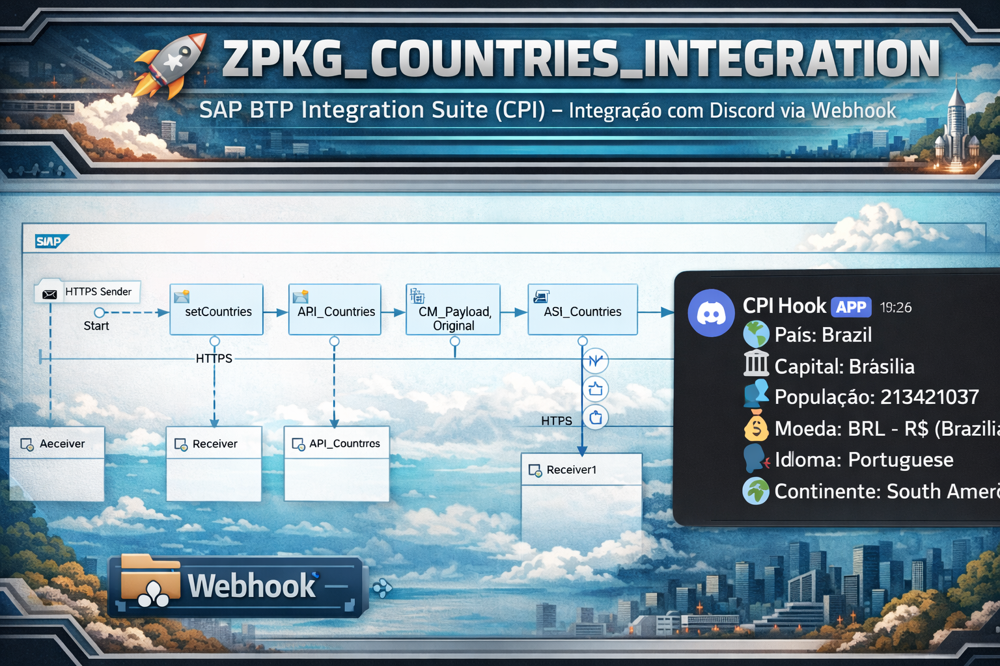

---

<br>

# 🏗️ 🔧 Arquitetura do iFlow

<br><br>

# 🔄 1. Fluxo da Integração

<br>

### 🧱 Criando o Package


<br><br>

### 🏷️ Nome do Package
```
ZPKG_COUNTRIES_INTEGRATION
```
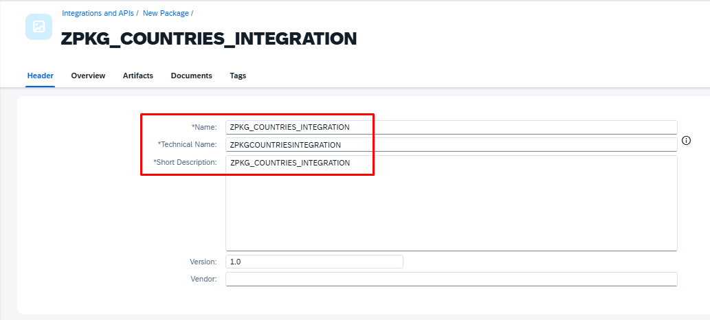

<br>

### ➕ Adicionando o Artefato
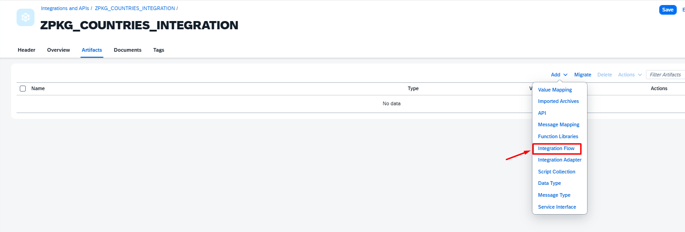

<br>

### 🏷️ Nome do iFlow
```
IF_SEND_MESSAGE_DISCORD
```
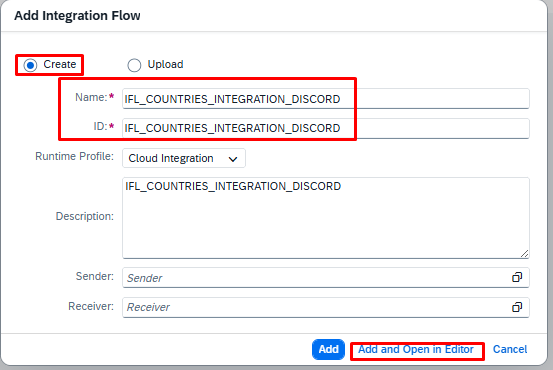

<br>

### ➕ Adicionando o Adapter
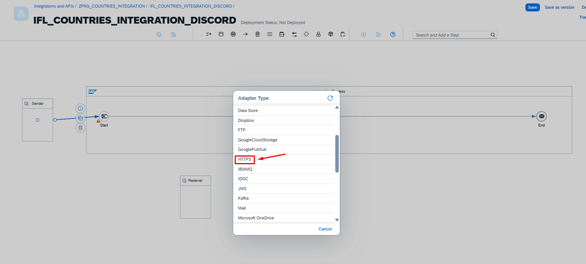

<br> 

# 🔹 2. HTTPS Sender (Trigger)
```
Endpoint: /discord
```
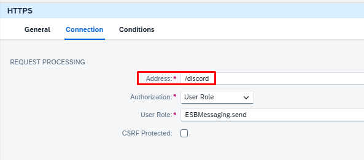

# 🔹 3. Content Modifier

### ➕ Adicionando o Content Modifier
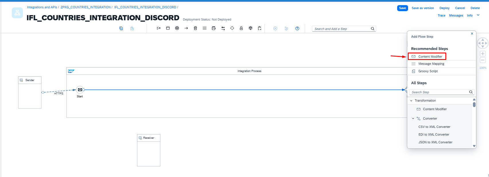

<br>

### 🏷️ Renomeando o Content Modifier
```
Nome: setCountries
```


<br>

### ⚙️ Configuração do Content Modifier
Message Header
```
| Campo     | Tipo Valor  |    Valor    |      Tipo        |
| --------- | ------------|-------------|------------------|
| Name      | Source Type |Source Value | Data Type        |
| country   | XPath       | /name       | java.lang.String |

```
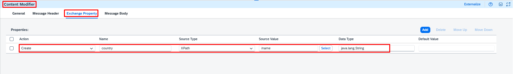

<br>

# 🔹 4. Request Reply (Chamada API)

### ➕ Adicionando Request Reply
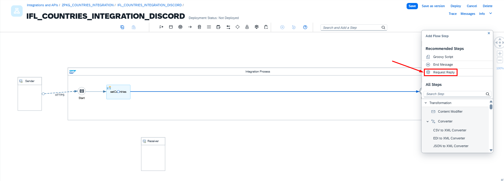

<br>

### 🏷️ Renomeando o Request Reply
```
Nome: API_Countries
```
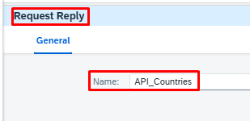

<br>

### ➕ Adicionando o Adapter
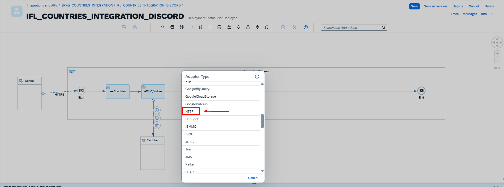

<br>

### ⚙️ Configuração do Request Reply
Mehod: GET
```
URL: [https://](https://restcountries.com/v3.1/name/${property.country})
```
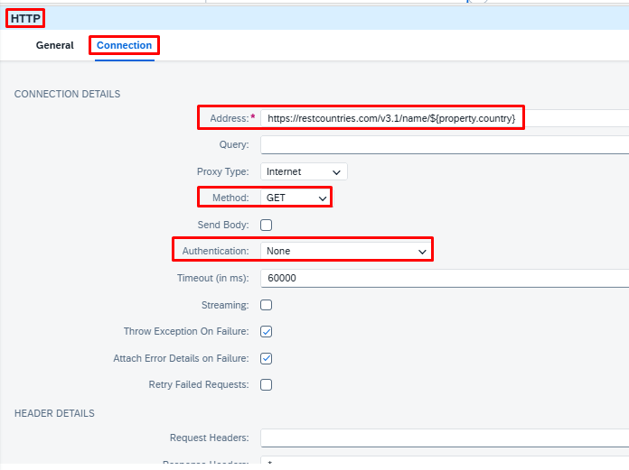

<br>

# 🔹 5. Content Modifier

### ➕ Adicionando o Content Modifier
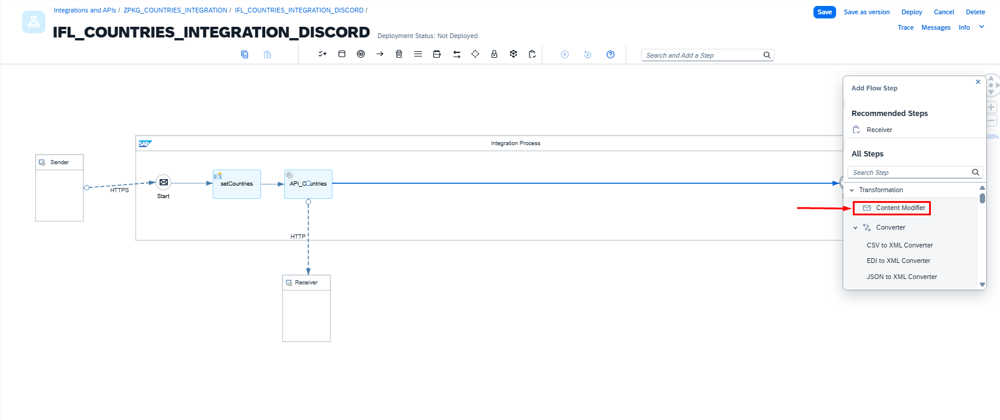

<br>

### 🏷️ Renomeando o Content Modifier
```
Nome: CM_Payload_Original
```
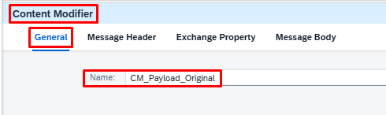


<br>

### ⚙️ Configuração do Content Modifier
Message Header
```
|     Campo     |     Tipo    |      Valor       |
| ------------- | ----------- | ---------------- |
|      Name     | Source Type |   Source Value   |
| Content Type  |   Constant  | application/json |

```
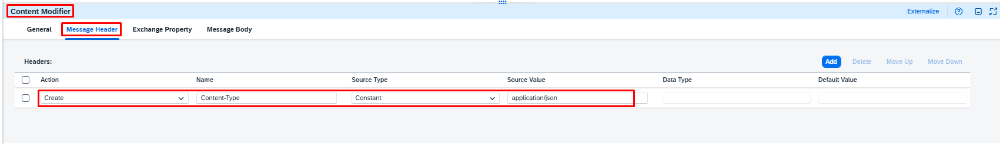

<br>

### ⚙️ Configuração do Content Modifier
Message Body
```
Type: Expression
Body: ${body}
```
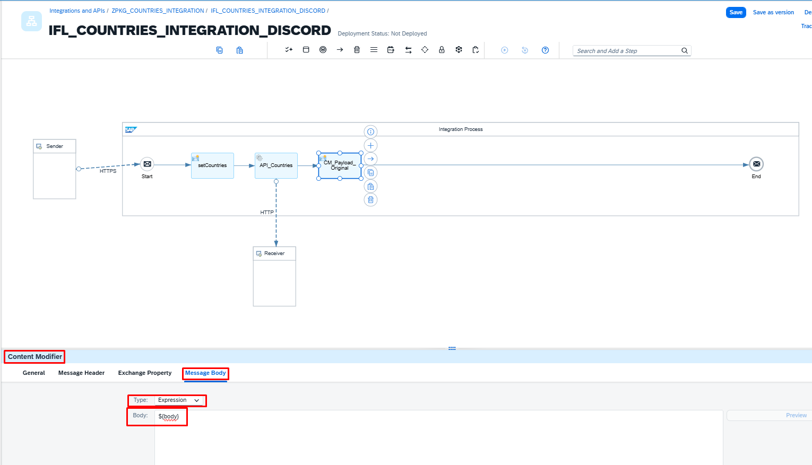

<br>

# 🔹 6. Groovy Script

### ➕ Adicionando Groovy Script
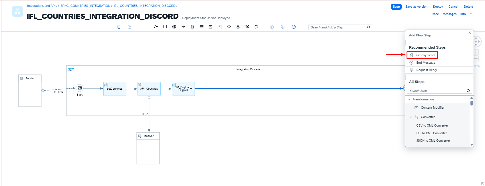

<br>

### 🏷️ Renomeando o Groovy Script
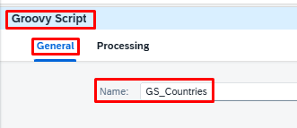
```
GS_Countries
```

<br>

### ➕ Adicionando Groovy Script
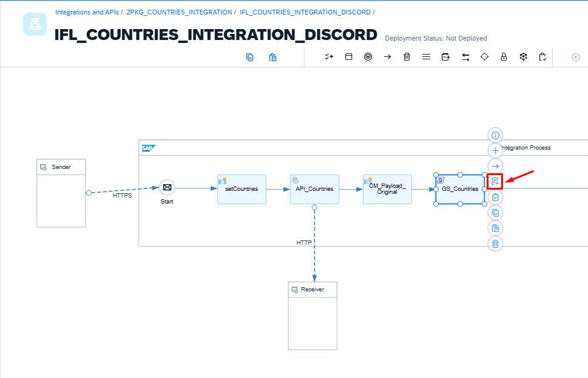

<br>

### ➕ Adicionando Groovy Script
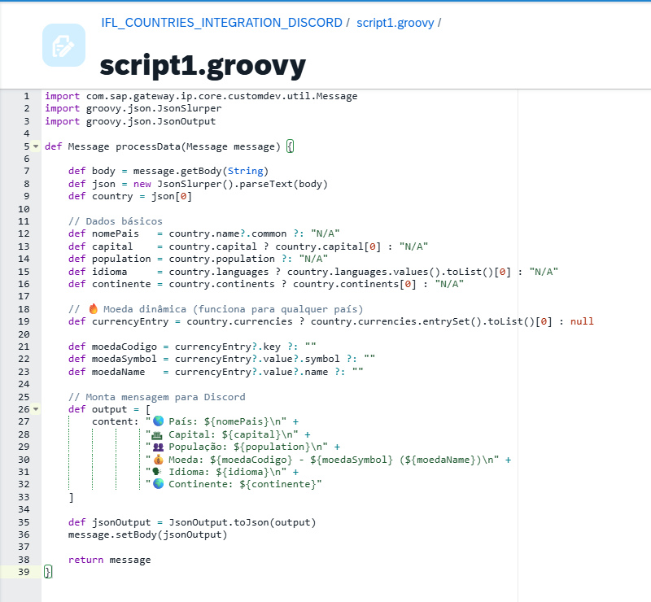
```
import com.sap.gateway.ip.core.customdev.util.Message
import groovy.json.JsonSlurper
import groovy.json.JsonOutput

def Message processData(Message message) {

    def body = message.getBody(String)
    def json = new JsonSlurper().parseText(body)
    def country = json[0]

    // Dados básicos
    def nomePais   = country.name?.common ?: "N/A"
    def capital    = country.capital ? country.capital[0] : "N/A"
    def population = country.population ?: "N/A"
    def idioma     = country.languages ? country.languages.values().toList()[0] : "N/A"
    def continente = country.continents ? country.continents[0] : "N/A"

    // 🔥 Moeda dinâmica (funciona para qualquer país)
    def currencyEntry = country.currencies ? country.currencies.entrySet().toList()[0] : null

    def moedaCodigo = currencyEntry?.key ?: ""
    def moedaSymbol = currencyEntry?.value?.symbol ?: ""
    def moedaName   = currencyEntry?.value?.name ?: ""

    // Monta mensagem para Discord
    def output = [
        content: "🌎 País: ${nomePais}\n" +
                 "🏛️ Capital: ${capital}\n" +
                 "👥 População: ${population}\n" +
                 "💰 Moeda: ${moedaCodigo} - ${moedaSymbol} (${moedaName})\n" +
                 "🗣️ Idioma: ${idioma}\n" +
                 "🌍 Continente: ${continente}"
    ]

    def jsonOutput = JsonOutput.toJson(output)
    message.setBody(jsonOutput)

    return message
}
```

<br>

# 🔹 7. Request Reply (Chamada API)

### ➕ Adicionando Request Reply
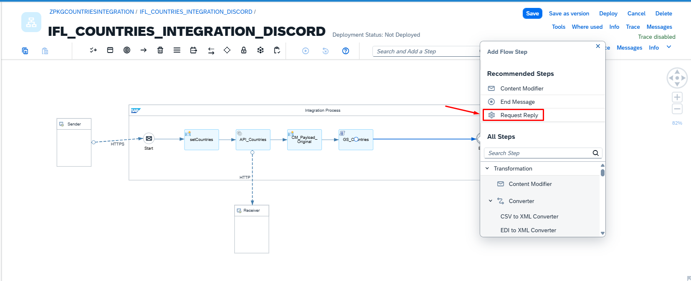

<br>

### 🏷️ Renomeando o Request Reply
```
Nome: API_Discord
```
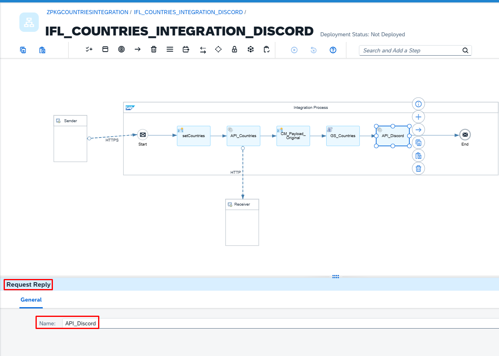

<br>

# 🔹 8. Receiver (Chamada API)
### ➕ Adicionando o Receiver
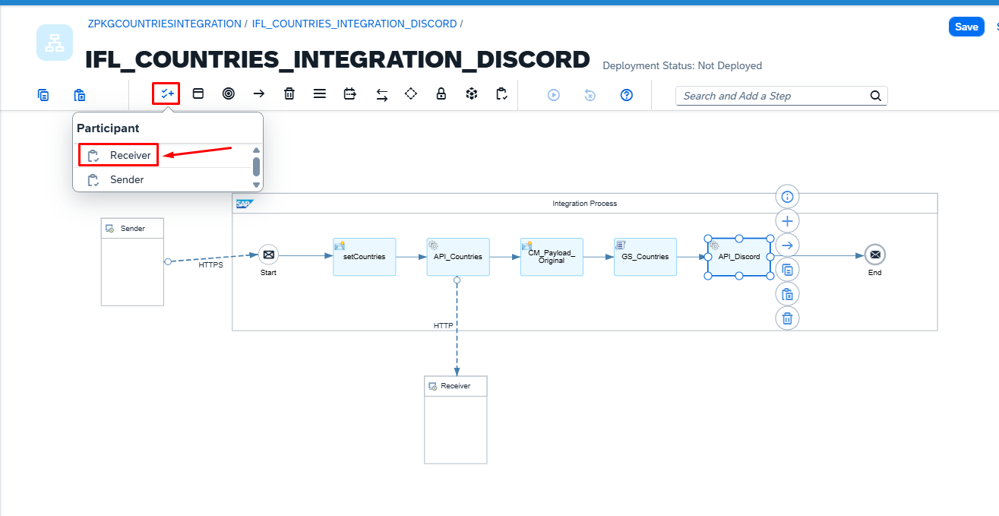

<br>

### ➕ Adicionando o Adapter Requet Replay
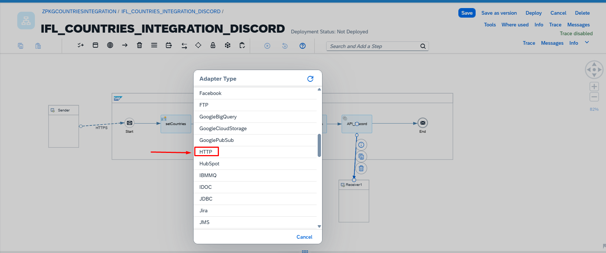

<br>

### ⚙️ Configuração do Request Reply

Mehod: POST
```
URL: https://discord.com/api/webhooks/{{DISCORD_WEBHOOK_ID}}/{{DISCORD_WEBHOOK_TOKEN}}
```
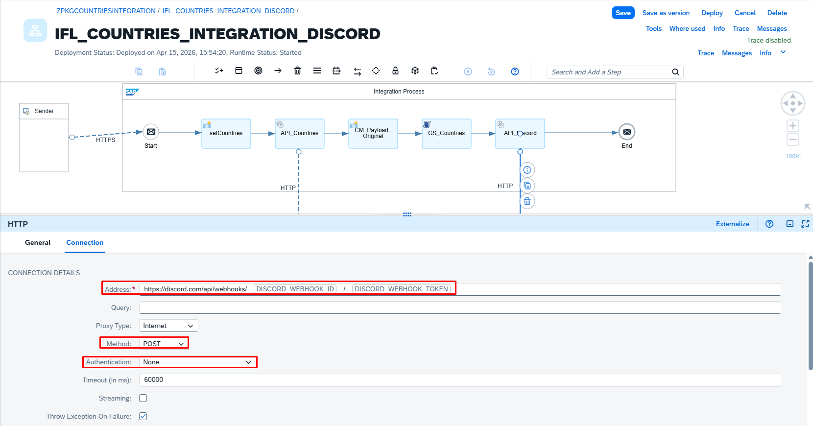

<br>

### ⚙️ Configuração da Externilazação
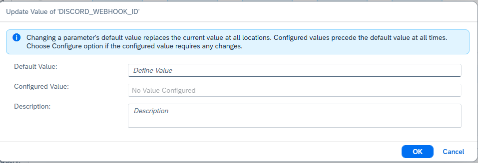
```
Colar o código do DISCORD_WEBHOOK_ID
```

<br>

### ⚙️ Configuração da Externilazação
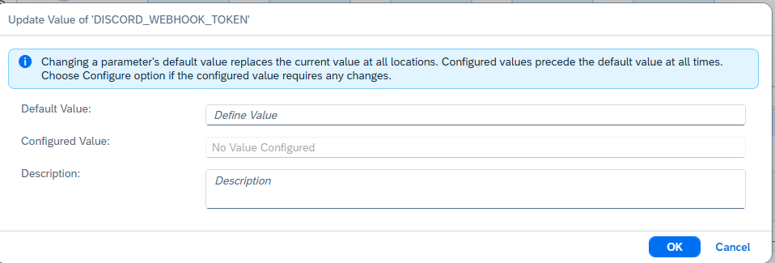
```
Colar o código do DISCORD_WEBHOOK_TOKEN
```

<br>

# 🔹 8. Discord

### ➕ Configurando o Canal
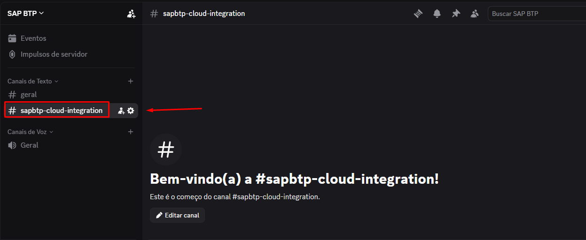

<br>

### ➡️ Integrações


<br>

### ⚙️ Configuração do Webhooks 
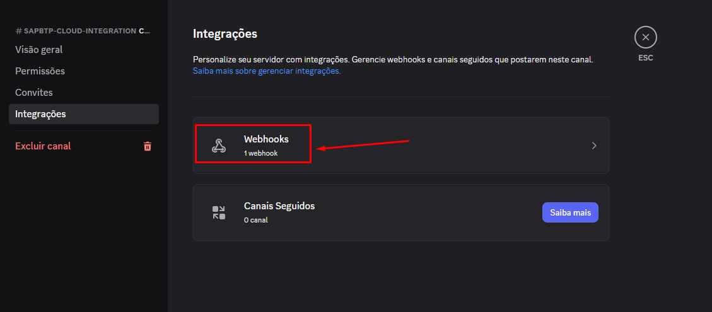

<br>

### ➕ Adicionando o Webhooks


<br>

### 🏷️ Renomeandoo o Webhooks


<br>

# 🔹 9. Iflow final
### ⚙️ Configuração final do Iflow 
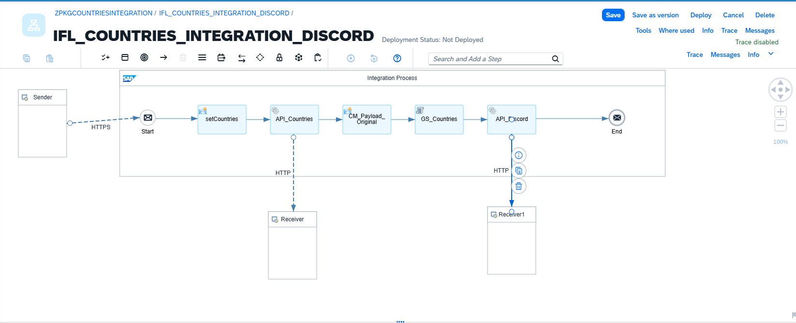

<br>

# 🔹 10. Postman

### ➕ Enviando o POST
BRASIL
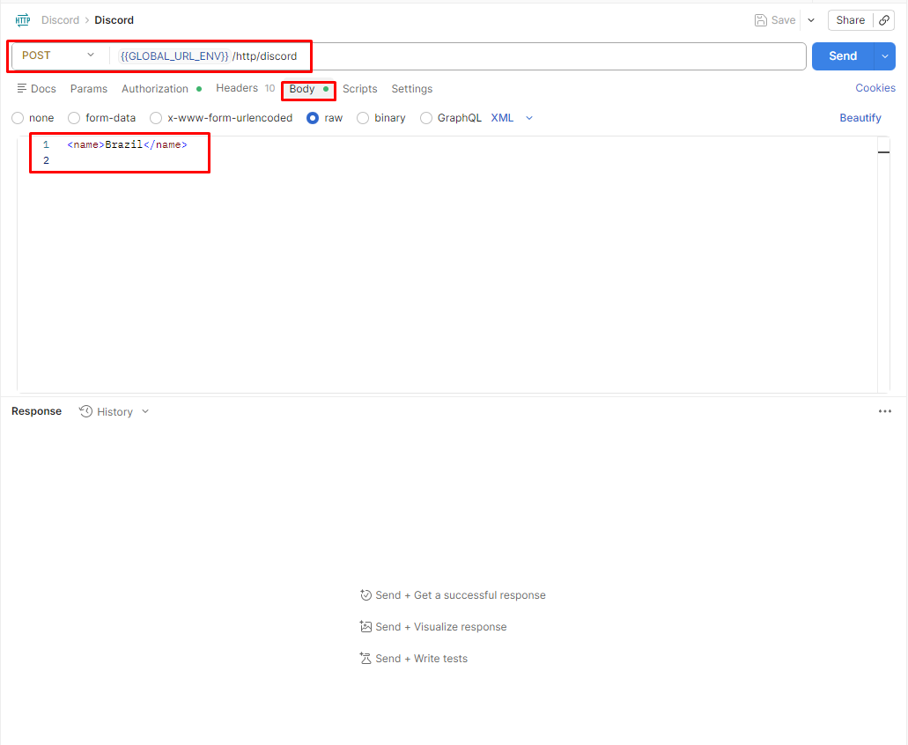


<br>

### ➕ Enviando o POST
Germany
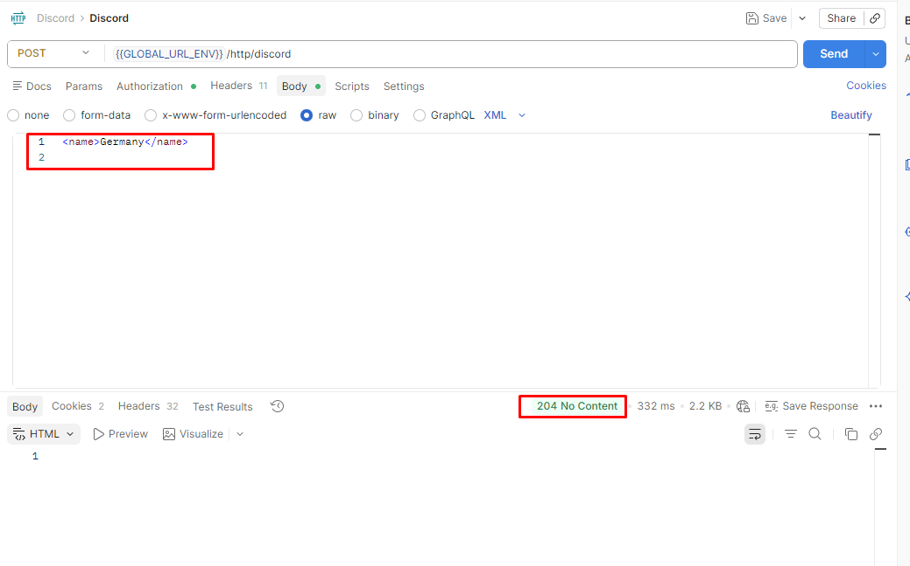

<br>

### ➕ Enviando o POST
Africa
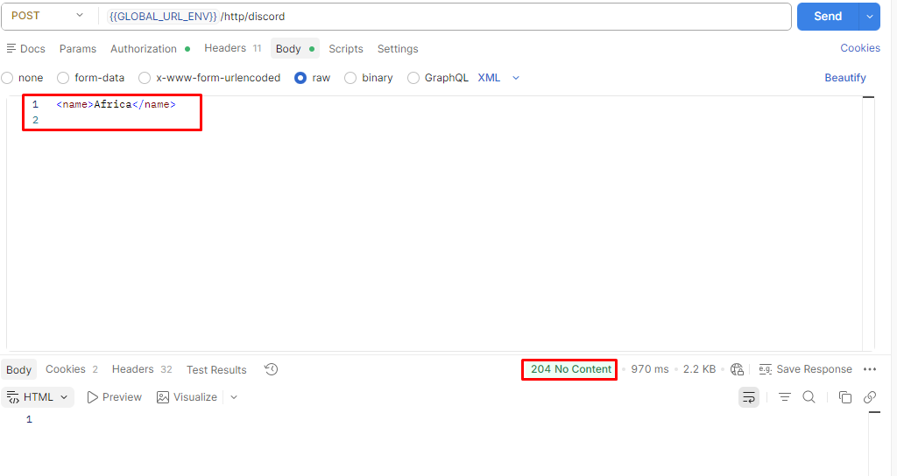

<br>

### 🏷️ Resultado no DISCORD


<br>
<br>

---

## 📦 Exemplo prático – iFlow para baixar

📦 [Download do iFlow – CPI_ZPKG_COUNTRIES_INTEGRATION](https://github.com/souzajean/ZPKG_COUNTRIES_INTEGRATION/raw/main/Package/IFL_COUNTRIES_INTEGRATION_DISCORD.zip)
